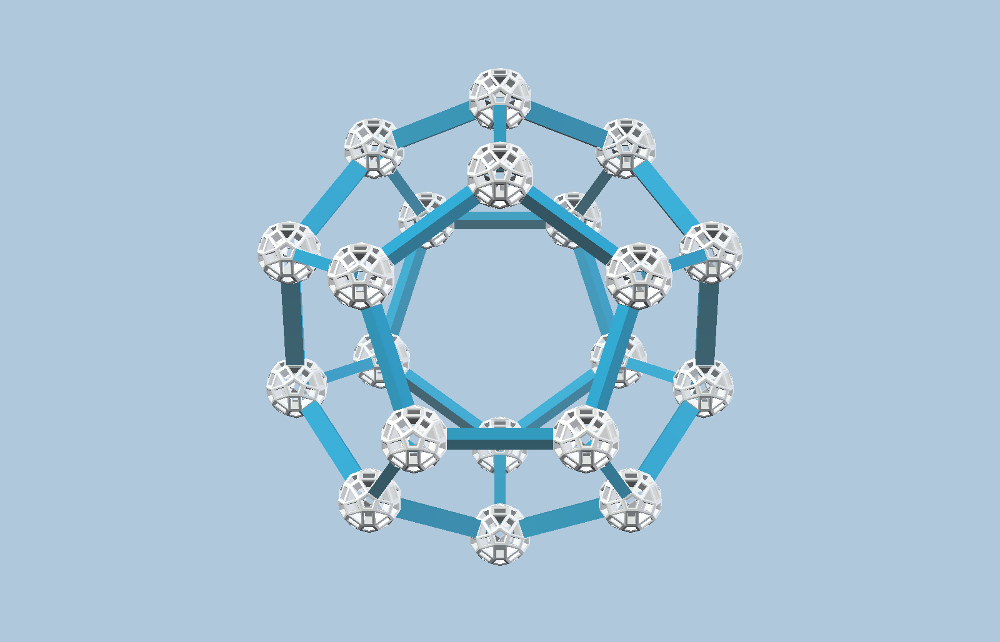
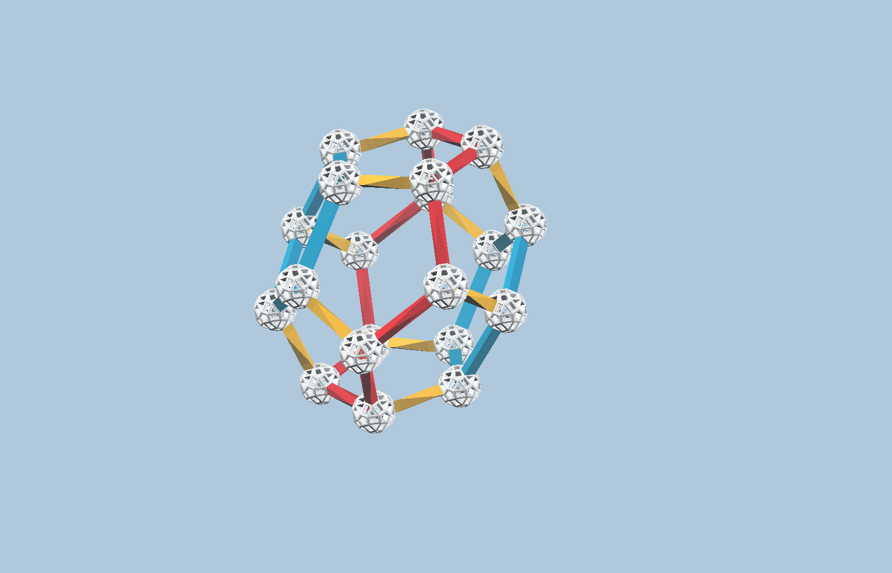
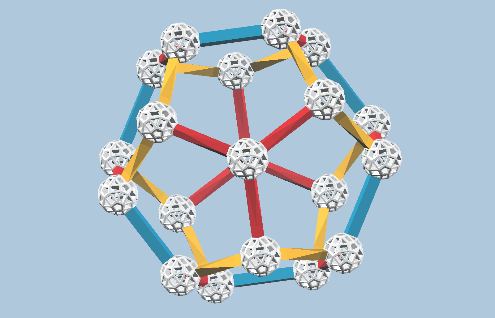
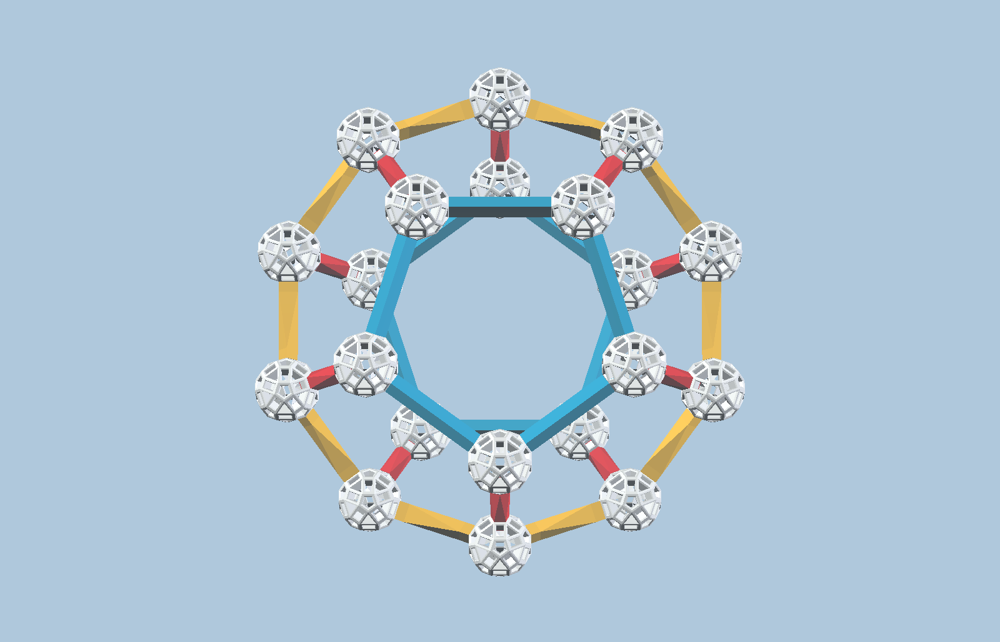
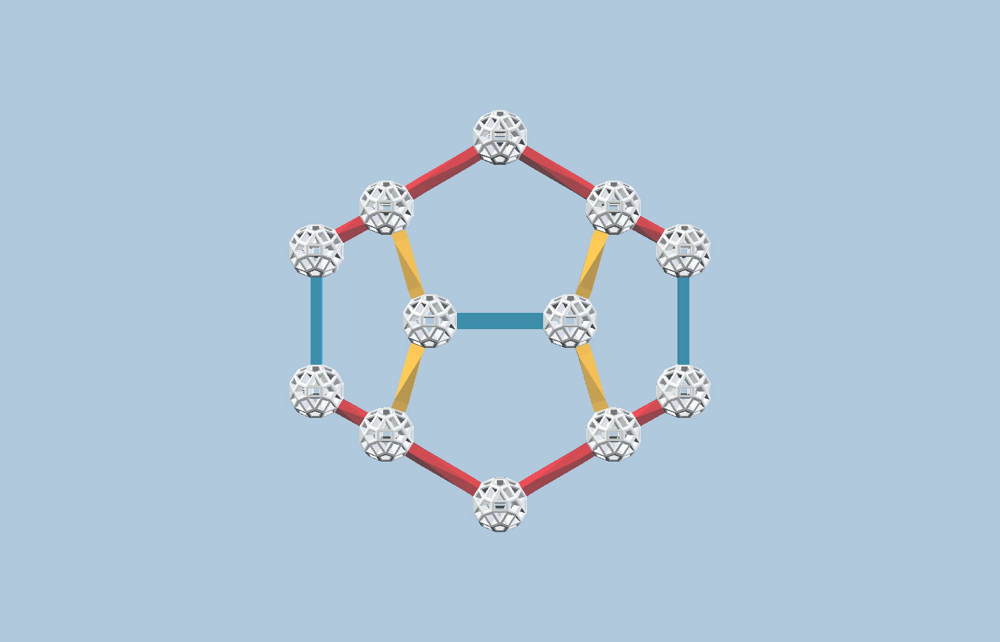

Hyperdo Day

 

## Hyperdo Day

On Jan 19, 2025, I made a Hyperdodecahedron. 
Here are the simple webpage links for each model in this kit. 
- [***Hyperdo Full Build***      ](<https://lucosmic.github.io/vzome-sharing/2025/01/19/00-00-25-PRJ-HYP-mod1-hyperdo/>)

  

  
- [***Build for Dodecahedron***  ](<https://lucosmic.github.io/vzome-sharing/2025/01/19/00-01-47-PRJ-HYP-mod2-dodeca/>)

  

  
- [***Build for Fat Red Cell***  ](<https://lucosmic.github.io/vzome-sharing/2025/01/19/00-02-31-PRJ-HYP-mod3-fatRed/>)

  

  
- [***Build for Yellow Cell***   ](<https://lucosmic.github.io/vzome-sharing/2025/01/19/00-03-50-PRJ-HYP-mod4-yellowCell/>)

  

- [***Build for Thin Red Cell*** ](<https://lucosmic.github.io/vzome-sharing/2025/01/19/00-06-18-PRJ-HYP-mod5-thinRed/>)

   

   
- [***Build for Flat Blue Cell***](<https://lucosmic.github.io/vzome-sharing/2025/01/19/00-08-21-PRJ-HYP-mod6-blueFlat/>)

   

 
